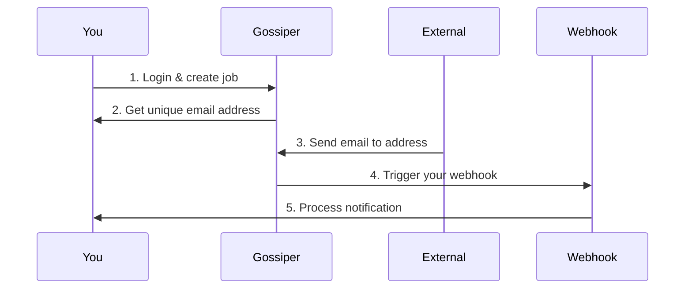

# Gossiper

[](https://drone.v3m.net/idriss/gossiper)




Feel free to self host it or simply use the deployed version: [here](https://app.v3m.pw)

## Project Structure 

There are three components

1. The web component was adapted and heavily changed from [Pagoda](https://github.com/mikestefanello/pagoda). What they did was great, but I needed something slightly different.
Among the big changes I made, I dropped `Ent` in favor of `Gorm`, I separated the sqlite
task queue from the postgres business DB, and many other things, yet I kept the structure
of the project because it made sense to me. With that being said, there are things I ported from there but I didn't clean yet
(like the contact page).
1. An self explanatory SMPT agent
2. A processing worker


## Development

```bash
docker compose -f docker-compose-test.yml up
```

```bash
go test ./...
```

```bash
air
```

## Deployment

There is a `.drone` deployment pipeline being used today (not from this repository since
it's just a mirror to the actual gitea source), so feel free to clone / fork and adjust
to your infrastructure.


## Video Demo

[Video](https://odysee.com/@jostiniane:a/gossip_dispatch:3?r=ApaoeHUrRuxq8iobUykDYxZFFXnoJgoM)
