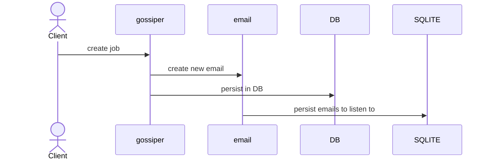
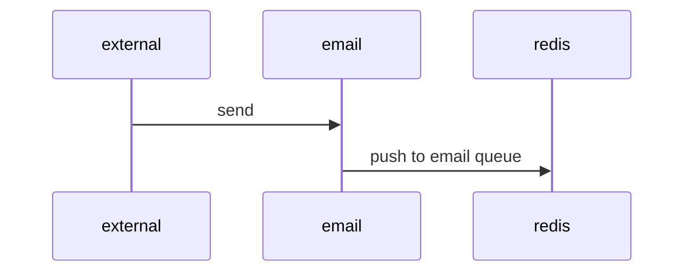
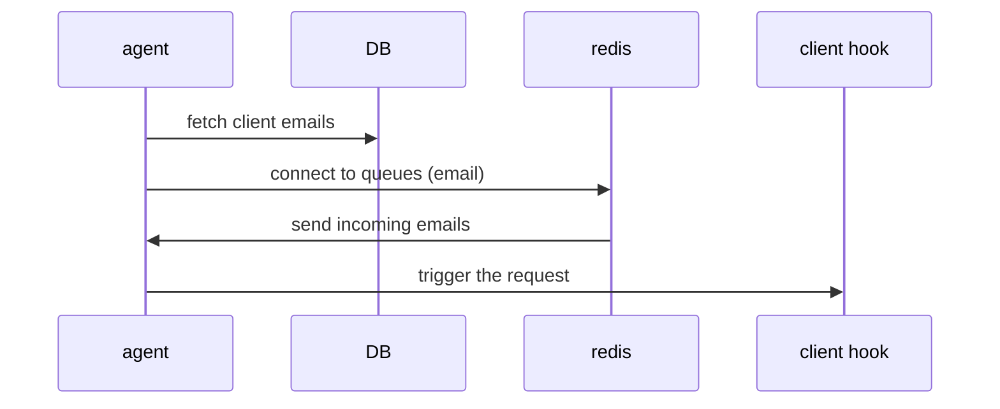

## Gossiper

Provides a SaaS Email --> API call

### Client Creates Job

```mermaid
sequenceDiagram
    actor Client
    Client ->> gossiper: create job
    gossiper ->> email: create new email
    gossiper ->> DB: persist in DB
    email ->> SQLITE: persist emails to listen to
```

### Email Received

```mermaid
sequenceDiagram
    external ->> email: send
    email ->> redis: push to email queue
```

### Worker

```mermaid
sequenceDiagram
    agent ->> DB: fetch client emails
    agent ->> redis: connect to queues (email)
    redis ->> agent: send incoming emails
    agent ->> client hook: trigger the request
```
